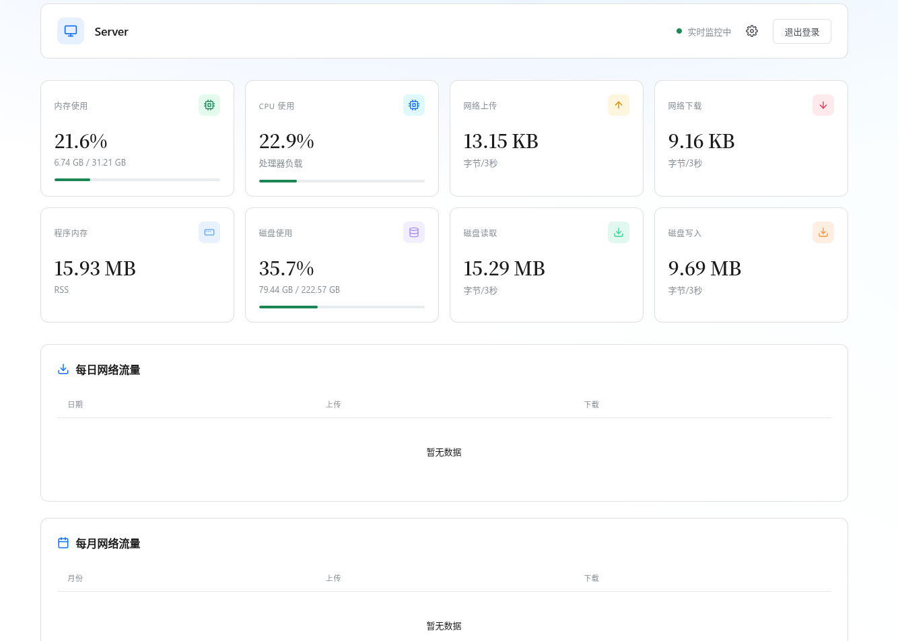
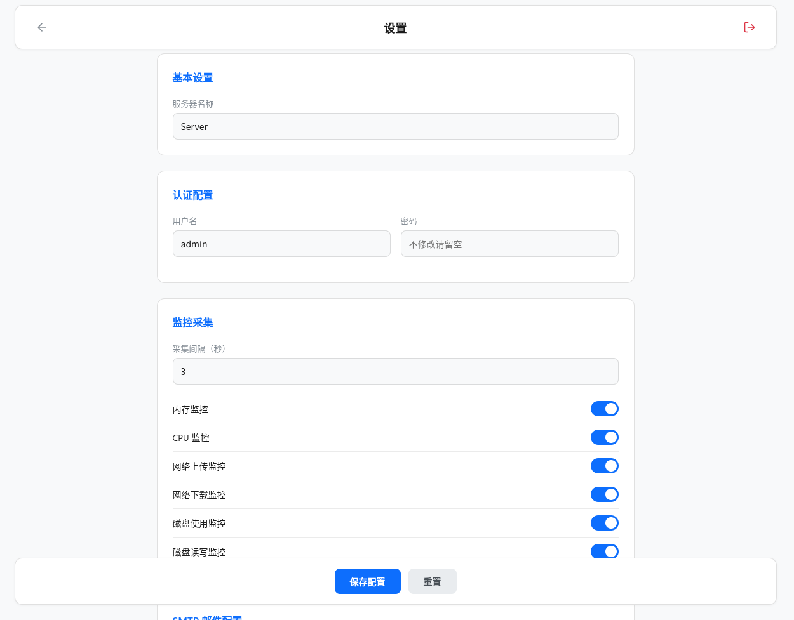

# go-monitor

Linux 系统轻量级资源监控工具，提供 Web 仪表盘和邮件告警功能。

## 界面预览

| 登录页 | 首页 | 设置页 |
|--------|------|--------|
|  |  |  |

## 功能特性

- **实时监控**: CPU、内存、磁盘 I/O、网络流量（Linux）
- **Web 仪表盘**: 通过浏览器查看当前和历史数据
- **邮件告警**: 可配置 CPU、内存、磁盘使用阈值告警
- **Systemd 集成**: 方便安装为 systemd 服务
- **SQLite 存储**: 本地数据库存储历史数据

## 支持平台

- Linux (Debian/Ubuntu 等)

## 安装

### 从 Release 安装

从 [GitHub Releases](https://github.com/lyj404/go-monitor/releases) 下载 deb 包：

```bash
sudo dpkg -i go-monitor_*.deb
```

或解压 tarball 并手动配置：

```bash
tar -xzf go-monitor_*.tar.gz
cd go-monitor
sudo cp go-monitor.service /lib/systemd/system/
sudo systemctl daemon-reload
sudo systemctl enable go-monitor
sudo systemctl start go-monitor
```

### 源码编译

```bash
git clone https://github.com/lyj404/go-monitor.git
cd go-monitor
go build -o go-monitor
```

## 配置

复制示例配置并按需修改：

```bash
cp config.example.yaml config.yaml
nano config.yaml
```

### 配置项说明

| 节点 | 选项 | 说明 |
|------|------|------|
| server | port | Web 服务端口（默认: 9527）|
| auth | username | Web 登录用户名 |
| auth | password | Web 登录密码 |
| monitor | interval | 监控间隔（秒）|
| monitor | memory/cpu/disk/network | 启用/禁用对应监控 |
| smtp | host/port/user/pass | 邮件服务器配置 |
| smtp | to | 告警邮件接收者 |
| alert | enabled | 启用/禁用告警 |
| alert | memory_threshold | 内存使用率告警阈值 |
| alert | disk_threshold | 磁盘使用率告警阈值 |

## 使用

```bash
./go-monitor -config config.yaml
```

访问 Web 仪表盘: `http://localhost:9527`

## 服务管理

```bash
# 启动
sudo systemctl start go-monitor

# 停止
sudo systemctl stop go-monitor

# 查看日志
sudo journalctl -u go-monitor -f
```

## 开发

```bash
# 编译
go build
```

## 许可证

Apache License 2.0